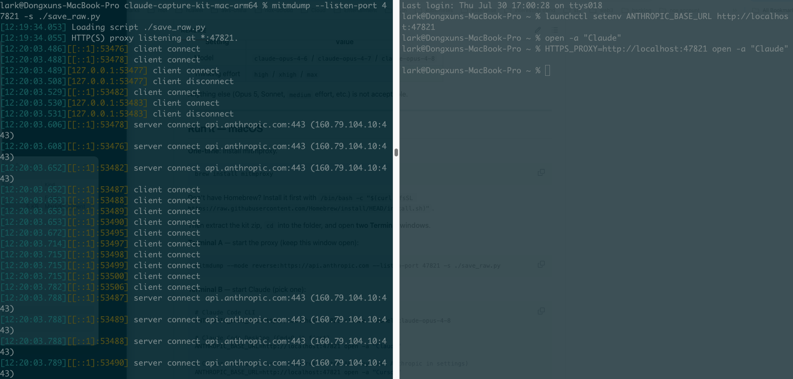
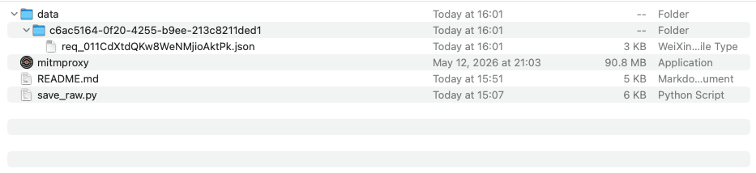

# Claude Capture Kit

Capture Claude Code / Cursor traffic on macOS or Windows. Output is delivery-ready JSON.



## Download

Pick your platform's zip from the [Releases page](../../releases):

- **macOS** → [claude-capture-kit-mac.zip](https://github.com/dongxuny/claude-capture-kit/releases/latest/download/claude-capture-kit-mac.zip) (5KB — you install mitmproxy via Homebrew)
- **Windows** → [claude-capture-kit-win.zip](https://github.com/dongxuny/claude-capture-kit/releases/latest/download/claude-capture-kit-win.zip) (26MB — includes `mitmdump.exe`)

## ⚠️ Required settings

| Setting | Value |
|---|---|
| Model | `claude-opus-4-6` / `claude-opus-4-7` / `claude-opus-4-8` / `claude-opus-5` / `claude-fable-5` |
| Thinking effort | `high` / `xhigh` / `max` |
| Desktop tab | **Code** only — not Home |

Anything else (Sonnet, Haiku, `medium` effort, Home-tab chat, etc.) is not acceptable.

**Why Code, not Home?** The Home tab uses `claude.ai`'s internal chat API, not `api.anthropic.com/v1/messages`. Its data format is different from what the spec requires and it produces no `thinking` blocks or `tool_use` blocks. Only Code tab conversations count.

---

## Setup — macOS

**One-time (install & trust mitmproxy):**

```bash
# 1) Install mitmproxy
brew install mitmproxy

# 2) Generate the CA cert (run mitmdump once, then Ctrl+C)
mitmdump &
sleep 3
kill $!

# 3) Trust the CA cert system-wide (needs your admin password)
sudo security add-trusted-cert -d -r trustRoot \
  -k /Library/Keychains/System.keychain \
  ~/.mitmproxy/mitmproxy-ca-cert.pem
```

## Run it — macOS

Extract the kit zip and open **two Terminal windows** in the extracted folder.

**Terminal A** — start the proxy (keep this window open):

```bash
mitmdump --listen-port 47821 -s ./save_raw.py
```

**Terminal B** — start Claude with the proxy (pick one):

```bash
# Claude Code CLI
HTTPS_PROXY=http://localhost:47821 claude --model claude-opus-4-8

# Claude Code Desktop (fully quit it first with Cmd+Q)
HTTPS_PROXY=http://localhost:47821 open -a "Claude"

# Cursor (fully quit it first with Cmd+Q)
HTTPS_PROXY=http://localhost:47821 open -a "Cursor"
```

Inside Claude, run `/effort high` to switch to high-effort thinking.

---

## Setup — Windows

**One-time (trust mitmproxy CA):**

The kit already includes `mitmdump.exe` — no separate install.

```powershell
# 1) Generate the CA cert (start mitmdump once, then Ctrl+C)
.\mitmdump.exe
# Wait ~5 seconds after "listening" appears, then Ctrl+C

# 2) Trust the CA cert — user-level, no admin needed
Import-Certificate -FilePath "$env:USERPROFILE\.mitmproxy\mitmproxy-ca-cert.cer" `
  -CertStoreLocation Cert:\CurrentUser\Root
```

Click **Yes** on the "Security Warning" dialog to confirm the trust.

If PowerShell also complains about `Import-Certificate` permissions, install the cert manually instead: open `%USERPROFILE%\.mitmproxy\` in Explorer, double-click `mitmproxy-ca-cert.cer`, click **Install Certificate → Current User → Place all certificates in the following store → Trusted Root Certification Authorities → OK → Yes**.

## Run it — Windows

Open **two PowerShell windows** in the extracted folder.

**Window A** — start the proxy (keep this window open):

```powershell
.\mitmdump.exe --listen-port 47821 -s .\save_raw.py
```

If SmartScreen blocks `mitmdump.exe`: right-click → Properties → check **Unblock** → OK.

**Window B** — start Claude:

For **Claude Code CLI**:

```powershell
$env:HTTPS_PROXY="http://localhost:47821"; claude --model claude-opus-4-8
```

For **Claude Code Desktop / Cursor**, set the env var user-wide, **fully kill the app**, then launch from the Start Menu:

```powershell
# 1) Turn capture ON
[Environment]::SetEnvironmentVariable("HTTPS_PROXY", "http://localhost:47821", "User")

# 2) FULLY kill Claude / Cursor. Closing the window is not enough — Claude minimizes to the system tray and keeps running. Use one of:
#    - Task Manager → find Claude / Cursor → End Task
#    - Or PowerShell:
Stop-Process -Name "Claude" -Force -ErrorAction SilentlyContinue
Stop-Process -Name "Cursor" -Force -ErrorAction SilentlyContinue

# 3) Launch Claude / Cursor from Start Menu — the new process will pick up HTTPS_PROXY

# 4) Turn capture OFF when done (and kill/restart Claude / Cursor)
[Environment]::SetEnvironmentVariable("HTTPS_PROXY", $null, "User")
```

Inside Claude, run `/effort high` to switch to high-effort thinking.

---

## Where the data goes

Every API call is saved into `data/` next to `save_raw.py`, grouped by session:



Each file is a single-line, spec-compliant JSON with tokens and Bearer headers auto-redacted.

## Send the data

**macOS**:

```bash
zip -r ~/Desktop/capture-$(whoami)-$(date +%Y%m%d).zip data/
```

**Windows** (PowerShell):

```powershell
Compress-Archive -Path .\data -DestinationPath "$env:USERPROFILE\Desktop\capture-$env:USERNAME-$(Get-Date -Format 'yyyyMMdd').zip"
```

Send the resulting Desktop zip to whoever collects captures.

## Troubleshooting

- **`SSL error` / `CERTIFICATE_VERIFY_FAILED`** — CA cert not trusted. Redo the "Setup" step for your platform.
- **`ConnectionRefused`** — the proxy in window A is not running or crashed.
- **Proxy runs but no logs appear** — Claude wasn't fully quit before relaunching, or `HTTPS_PROXY` isn't set in the current session.
- **Windows: closed Claude but still no capture** — Claude Desktop minimizes to the system tray on close; it's still running. Open Task Manager, find Claude, End Task. Then relaunch from Start Menu.
- **macOS: `mitmdump: command not found`** — `brew install mitmproxy` didn't complete or PATH wasn't refreshed. Open a new Terminal window and try again.
- **Cursor traffic missing** — Cursor is on its own subscription. Switch to Custom API Key + Anthropic in settings.
- **Wrong model selected** — for the CLI, pass `--model claude-opus-4-8` (or another allowed model) explicitly. For Desktop / Cursor, pick from the model menu.
- **Claude Desktop: chatting in Home tab produces no captures** — Home uses `claude.ai`'s internal API, not `api.anthropic.com`. Switch to the **Code** tab.
